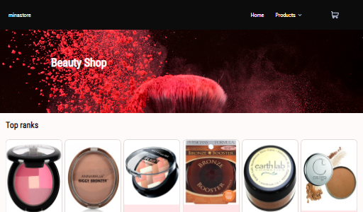
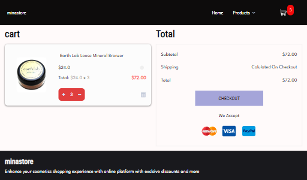
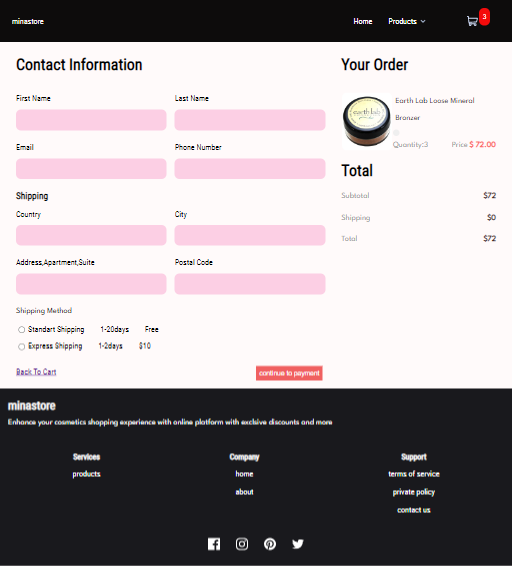
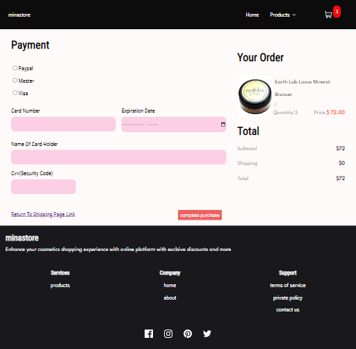
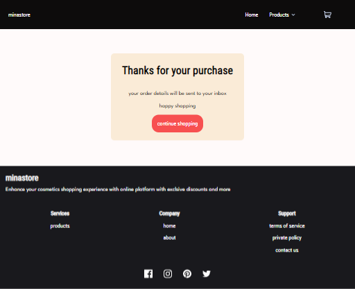

## Minastore

An e-commerce application used to purchase cosmetics from different brands based on user preference, built with React, Redux, JavaScript, and CSS.

## Project Status

95%

#### Example:

This project is currently in development. Users can filter products by brands and see visual data representation. Functionality to sort by additional parameters is in progress.

## Project Screen Shots

## Installation and Setup Instructions

Clone down this repository. You will need `node` and `npm` installed globally on your machine.

Installation:

`npm install`

To Start Server:

`npm start`

To Visit App:

`localhost:3000/`

## Reflection

- What was the context for this project?

  A side project

- What do you set out to build?

A cosmetics e-commerce store that dislpays products and adds items to cart ,displays cart content and checkout

- Project challenging and therefore a really good learning experience?

Desiging out the ux/ui of an e-commerce 

I learnt to use "find" array method/function

Saving data in using local storage

- What were some unexpected obstacles?

How display a large list of data from RESTFUL API to and avoid list-related performance issues

How to display a sub navigation when an element is click

Manipulating cart data

- What tools did you use to implement this project?
 
  Create-react-app

  React-router-dom

 
Live url [https://ibimina-minastore.netlify.app](https://ibimina-minastore.netlify.app)
